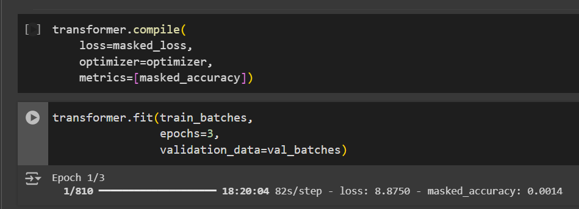

# traducao-com-transformer

A imagem abaixo mostra o novo modelo após alteração de alguns parâmetros como número de camadas e batchs, o resultado foi um modelo bem demorado para execução. Abaixo faço uma melhor análise sobre pontos positivos e negativos do uso desse modelo para tradução de mensagens.

## Pontos Positivos

1. **Desempenho em traduções**:
   O modelo Transformer demonstrou uma grande capacidade de lidar com dependências de longo prazo, resultando em traduções precisas. A abordagem de autoatenção permitiu capturar contextos de maneira eficaz em frases complexas.
  É possível perceber pela documentação do Tensorflow, ele faz diversos testes e é possível observar um bom resultado prático.
  A acurácia chegou a ficar em quase 70%.

2. **Escalabilidade**:
   O modelo é altamente escalável, o que o torna adequado para tarefas de tradução com grandes conjuntos de dados. A arquitetura pode ser expandida para diferentes idiomas e tamanhos de frases sem perda significativa de desempenho.
   

## Pontos Negativos

1. **Alto custo computacional**:
   O tempo necessário para o treinamento do modelo foi bastante longo, mesmo ao usar uma GPU. Isso pode ser um empecilho para quem não tem acesso a recursos computacionais avançados, limitando a acessibilidade do modelo para aprendizado e testes rápidos.
   Tentei executar na minha máquina o modelo, mas o treinamento se tornou inviiável pelo Google Colab, tanto com CPU quanto com GPU, o tempo estimado para cada época estava estimado para quase 2 horas no melhor dos casos.

3. **Complexidade de implementação**:
   É necessário ter uma bagagem de conhecimentos para entender o código e o funcionamento do modelo, principalmente por se tratar de um Transformer. Então, não é tão fácil de entender como o modelo opera.

